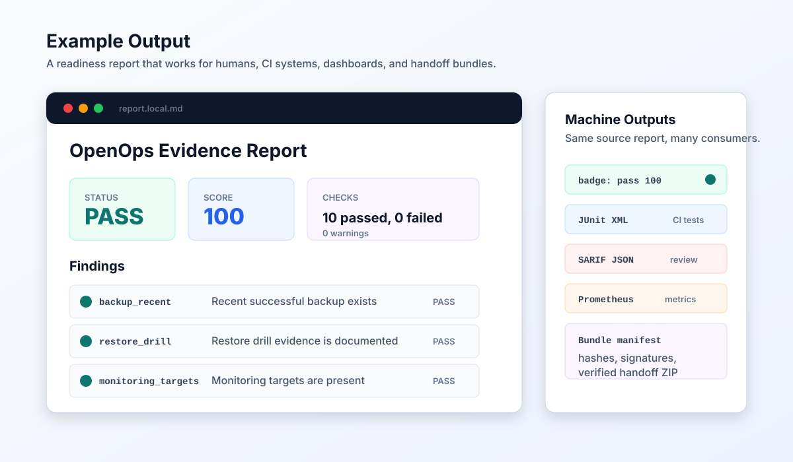
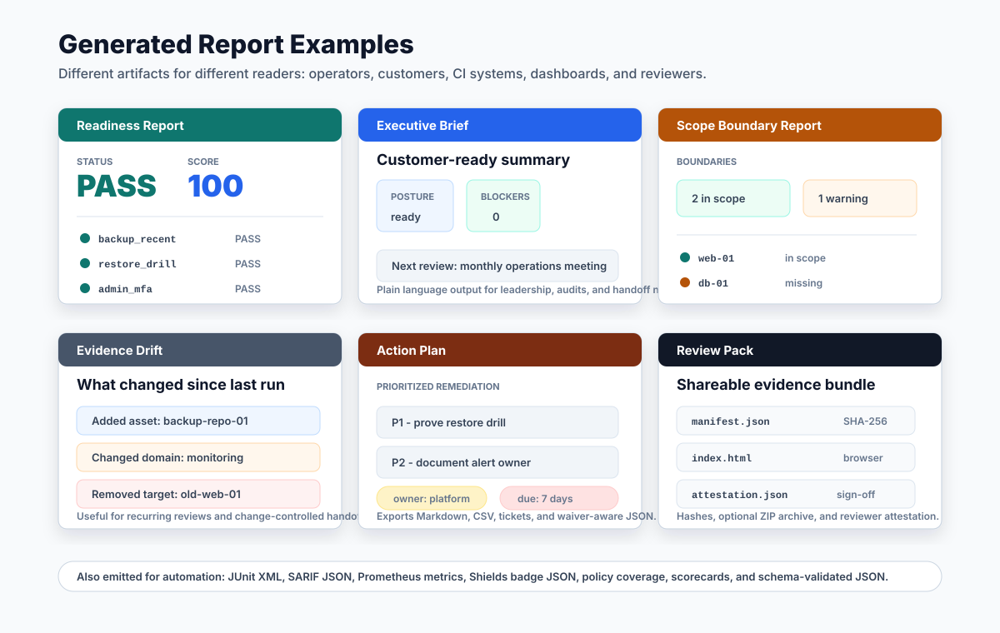

# OpenOps EvidenceKit


OpenOps EvidenceKit is a vendor-neutral command line toolkit for collecting,
checking, redacting, and reporting infrastructure operations evidence.

It is designed for small infrastructure teams, managed service providers,
platform teams, associations, agencies, and self-hosters who need repeatable
answers to practical readiness questions:

- Are backups configured and recently successful?
- Has a restore drill been proven?
- Are monitoring targets and alert channels present?
- Are administrative entry points protected?
- Are TLS, mail, inventory, and runbook basics documented?
- Can evidence be shared without leaking secrets or customer data?

The project intentionally keeps the core deterministic. AI systems can help
review reports, suggest remediation, or draft runbooks, but the evidence checks
themselves are plain rules that can be audited and run in CI.

Automation exit codes are documented in [docs/exit-codes.md](docs/exit-codes.md).

## Example Output



The same report can be rendered for people, CI systems, dashboards, and
handoff bundles: Markdown or BookStack pages, HTML, JUnit XML, SARIF JSON,
Prometheus text metrics, a Shields-compatible badge, executive briefs, action
plans, risk registers, service catalog reports, evidence freshness reports,
domain scorecards, tickets, and signed evidence bundles.

### Report Artifact Gallery



Typical generated report artifacts include readiness reports, executive briefs,
scope boundary reports, evidence drift reports, prioritized action plans, and
risk registers, restore assurance reports, mail domain reports, TLS certificate
reports, access exposure reports, plus review packs with one-page summaries, manifests, and
attestations.

## Status

This project is in early alpha. The first release focuses on a stable evidence
shape, a small policy engine, redaction, and human-readable reports.

## Quick Start

Run from a checkout:

```powershell
python -m openops_evidence --version
python -m openops_evidence scaffold evidence examples/policy.baseline.toml --organization "Example Operations Team" --environment production -o evidence.scaffold.json
python -m openops_evidence collect fixture examples/evidence.sample.json -o evidence.local.json
python -m openops_evidence validate -i evidence.local.json
python -m openops_evidence questionnaire policy examples/policy.baseline.toml -o questionnaire.md
python -m openops_evidence inventory evidence -i evidence.local.json -o inventory.md
python -m openops_evidence freshness report -i evidence.local.json --max-age-days 30 -o freshness-report.md
python -m openops_evidence restore report -i evidence.local.json --max-drill-age-days 90 -o restore-report.md
python -m openops_evidence mail report -i evidence.local.json -o mail-report.md
python -m openops_evidence tls report -i evidence.local.json -o tls-report.md
python -m openops_evidence access report -i evidence.local.json -o access-report.md
python -m openops_evidence scope validate examples/scope.sample.toml
python -m openops_evidence scope report -i evidence.local.json -s examples/scope.sample.toml -o scope-report.md
python -m openops_evidence catalog validate examples/service-catalog.sample.toml
python -m openops_evidence catalog report -i evidence.local.json -c examples/service-catalog.sample.toml -o service-catalog.md
python -m openops_evidence runbook report -i evidence.local.json -c examples/service-catalog.sample.toml --max-age-days 365 -o runbook-report.md
python -m openops_evidence evidence diff --base examples/evidence.previous.json --current evidence.local.json -f markdown -o evidence-drift.md
python -m openops_evidence coverage report -i evidence.local.json -p examples/policy.baseline.toml -o policy-coverage.md
python -m openops_evidence check -i evidence.local.json -p examples/policy.baseline.toml -o report.local.json
python -m openops_evidence gate report -i report.local.json --min-score 90 --max-warnings 0 -o gate-result.json
python -m openops_evidence badge report -i report.local.json -o readiness-badge.json
python -m openops_evidence brief report -i report.local.json -o executive-brief.md
python -m openops_evidence risk register -i report.local.json --waivers examples/waivers.sample.toml -f markdown -o risk-register.md
python -m openops_evidence scorecard report -i report.local.json -o scorecard.md
python -m openops_evidence history append -i report.local.json --source local -o readiness-history.json
python -m openops_evidence history render -i readiness-history.json -f markdown -o readiness-history.md
python -m openops_evidence history render -i readiness-history.json -f svg -o readiness-history.svg
python -m openops_evidence report -i report.local.json -f markdown -o report.local.md
python -m openops_evidence report -i report.local.json -f junit -o report.local.junit.xml
python -m openops_evidence report -i report.local.json -f sarif -o report.local.sarif.json
python -m openops_evidence report -i report.local.json -f prometheus -o report.local.prom
python -m openops_evidence review create -i evidence.local.json -p examples/policy.baseline.toml --scope examples/scope.sample.toml --catalog examples/service-catalog.sample.toml --base-evidence examples/evidence.previous.json -o review-pack --archive review-pack.zip --min-score 90 --max-warnings 0
python -m openops_evidence attest review --manifest review-pack/manifest.json --report review-pack/report.json --gate review-pack/gate-result.json --scope-report review-pack/scope-report.json --evidence-drift review-pack/evidence-drift.json --privacy-scan review-pack/privacy-scan.json --approver "Example Reviewer" --role "Operations" --statement "Reviewed generated artifacts for internal handoff." -o review-attestation.json
```

See [docs/demo-workflow.md](docs/demo-workflow.md) for a complete synthetic
end-to-end run.

Render a wiki-friendly report:

```powershell
python -m openops_evidence report -i report.local.json -f bookstack -o readiness.bookstack.md
```

Compare two reports over time:

```powershell
python -m openops_evidence compare --base previous-report.json --current report.local.json -f markdown -o report.comparison.md
```

Turn findings into a prioritized action plan:

```powershell
python -m openops_evidence plan -i report.local.json -f markdown -o action-plan.md
python -m openops_evidence plan -i report.local.json -f csv -o action-plan.csv
python -m openops_evidence waiver validate examples/waivers.sample.toml
python -m openops_evidence plan -i report.local.json --waivers examples/waivers.sample.toml -o action-plan.json
python -m openops_evidence risk register -i report.local.json --waivers examples/waivers.sample.toml -o risk-register.json
python -m openops_evidence ticket export -i action-plan.json -o action-tickets
```

Create a hash manifest for the files you plan to share:

```powershell
python -m openops_evidence bundle manifest evidence.redacted.json report.local.json gate-result.json readiness.bookstack.md -o evidence-bundle.manifest.json
python -m openops_evidence bundle verify evidence-bundle.manifest.json --base-dir . -o evidence-bundle.verification.json
python -m openops_evidence bundle archive evidence-bundle.manifest.json --base-dir . -o evidence-bundle.zip
```

Sign the reviewed bundle manifest before sharing it:

```powershell
python -m openops_evidence bundle sign evidence-bundle.manifest.json --key-file .secrets/openops-bundle-signing.key --key-id ops-2026 -o evidence-bundle.signature.json
python -m openops_evidence bundle verify-signature evidence-bundle.manifest.json evidence-bundle.signature.json --key-file .secrets/openops-bundle-signing.key --fail-on-invalid -o evidence-bundle.signature-verification.json
```

Merge evidence from multiple sources:

```powershell
python -m openops_evidence merge examples/evidence.sample.json examples/evidence.tls.sample.json -o evidence.merged.json
```

Or inspect a TLS endpoint:

```powershell
python -m openops_evidence collect tls example.com -o tls-evidence.json
```

Turn `restic snapshots --json` output into backup evidence:

```powershell
restic snapshots --json > restic.snapshots.json
python -m openops_evidence collect restic-snapshots restic.snapshots.json -o backup.evidence.json
```

Turn `borg list --json` output into backup evidence:

```powershell
borg list --json /path/to/repo > borg.archives.json
python -m openops_evidence collect borg-archives borg.archives.json -o borg.evidence.json
```

Import an Uptime Kuma backup/export file:

```powershell
python -m openops_evidence collect uptime-kuma uptime-kuma-export.json -o monitoring.evidence.json
```

Import Prometheus target health:

```powershell
curl http://prometheus.example.invalid/api/v1/targets > prometheus.targets.json
python -m openops_evidence collect prometheus-targets prometheus.targets.json -o prometheus.evidence.json
```

Import runtime evidence from systemd and Docker exports:

```powershell
systemctl list-timers --all --output=json > systemd.timers.json
python -m openops_evidence collect systemd-timers systemd.timers.json -o systemd.evidence.json

docker ps -a --format '{{json .}}' > docker.containers.jsonl
python -m openops_evidence collect docker-containers docker.containers.jsonl -o docker.evidence.json
```

Collect documentation inventory and runbook evidence:

```powershell
python -m openops_evidence collect docs ./docs --required inventory.md --required runbooks/backup-restore.md --max-age-days 90 -o docs.evidence.json
```

Use redaction before sharing evidence outside your organization:

```powershell
python -m openops_evidence redact -i evidence.local.json --redact-hostnames -o evidence.redacted.json
python -m openops_evidence privacy scan evidence.redacted.json report.local.md -f markdown -o privacy-scan.md
```

Read [docs/privacy-model.md](docs/privacy-model.md) before publishing or
sharing evidence bundles. Redaction is a safeguard, not a substitute for review.

Create starter files for a new assessment:

```powershell
python -m openops_evidence init ./my-readiness-check
python -m openops_evidence init ./my-readiness-check --github-actions
```

List and export bundled policy packs:

```powershell
python -m openops_evidence policy list
python -m openops_evidence policy operators
python -m openops_evidence policy show security-minimum -o policy.security-minimum.toml
python -m openops_evidence policy show security-minimum@0.1 -o policy.security-minimum.toml
python -m openops_evidence policy validate policy.security-minimum.toml
python -m openops_evidence policy matrix policy.security-minimum.toml -f markdown -o policy.matrix.md
```

## Core Concepts

EvidenceKit uses three files:

- Evidence JSON: observed facts from infrastructure and documentation.
- Policy TOML: readiness rules that say what "good enough" means.
- Report JSON/Markdown/HTML: evaluated results with findings and remediation.

Use `merge` when evidence comes from multiple collectors or manually reviewed
sources.
Use `scaffold evidence` when a policy should become a schema-valid starter
Evidence JSON file with placeholders for every supported `signals.*` path.
Use `inventory evidence` when raw evidence should become a Wiki- or
spreadsheet-friendly asset and signal-domain inventory.
Use `freshness report` when timestamp-like evidence fields should be checked for
stale, future, or invalid values before a handoff.
Use `restore report` when backup recency and restore drill proof should become
a standalone operational assurance artifact.
Use `mail report` when SPF, DKIM, and DMARC evidence should become a standalone
mail-domain hygiene artifact.
Use `tls report` when certificate expiry evidence should become a standalone
renewal-risk artifact.
Use `access report` when public SSH, MFA, and administrative entrypoints should
be reviewed as a standalone access exposure artifact.
Use `scope report` when the assessment needs explicit in-scope, out-of-scope,
missing, and unclassified evidence boundaries.
Use `catalog report` when service ownership, criticality, assets, evidence
domains, and runbook coverage should be reviewed together.
Use `runbook report` when required runbooks should be checked for presence,
freshness, service references, and orphaned documentation.
Use `evidence diff` when recurring runs should show asset and signal-domain
drift before the policy result is interpreted.

Action plans can also consume risk waiver TOML/JSON. Waivers require an owner,
reason, check ID, and expiry date, so accepted risks stay explicit and expire
back into the remediation queue. Ticket export turns non-waived action items
into Markdown files that can be copied into GitHub Issues, GitLab, Jira, service
desk tools, or a plain Git-backed runbook queue.
Risk registers use the same waivers to distinguish open, accepted, expired, and
closed risks for recurring review meetings.

JSON Schemas for generated artifacts live in [schemas/](schemas/).
Example inputs and generated artifact shapes are described in
[examples/README.md](examples/README.md).
Bundled policies are described in [docs/policy-packs.md](docs/policy-packs.md).
Bundle manifests are described in [docs/bundle-manifest.md](docs/bundle-manifest.md).
Report comparisons are described in [docs/report-comparison.md](docs/report-comparison.md).
Report history tracking is described in [docs/report-history.md](docs/report-history.md).
Executive briefs are described in [docs/executive-brief.md](docs/executive-brief.md).
Evidence inventories are described in [docs/evidence-inventory.md](docs/evidence-inventory.md).
Evidence scaffolds are described in [docs/evidence-scaffold.md](docs/evidence-scaffold.md).
Evidence drift reports are described in [docs/evidence-drift.md](docs/evidence-drift.md).
Evidence freshness reports are described in [docs/freshness-report.md](docs/freshness-report.md).
Restore assurance reports are described in [docs/restore-report.md](docs/restore-report.md).
Mail domain reports are described in [docs/mail-report.md](docs/mail-report.md).
TLS certificate reports are described in [docs/tls-report.md](docs/tls-report.md).
Access exposure reports are described in [docs/access-report.md](docs/access-report.md).
Scope reports are described in [docs/scope-report.md](docs/scope-report.md).
Service catalog reports are described in [docs/service-catalog.md](docs/service-catalog.md).
Runbook coverage reports are described in [docs/runbook-report.md](docs/runbook-report.md).
Review packs are described in [docs/review-pack.md](docs/review-pack.md).
Review summaries are described in [docs/review-summary.md](docs/review-summary.md).
Review attestations are described in [docs/review-attestation.md](docs/review-attestation.md).
Domain scorecards are described in [docs/scorecard.md](docs/scorecard.md).
Policy coverage reports are described in [docs/policy-coverage.md](docs/policy-coverage.md).
Policy questionnaires are described in [docs/questionnaire.md](docs/questionnaire.md).
Action plans are described in [docs/action-plan.md](docs/action-plan.md).
Risk registers are described in [docs/risk-register.md](docs/risk-register.md).
CI gates are described in [docs/gates.md](docs/gates.md).
Status badges are emitted as Shields-compatible endpoint JSON and can be used
in README files, internal portals, or wiki dashboards. See
[docs/status-badges.md](docs/status-badges.md).
Prometheus text output is described in
[docs/prometheus-output.md](docs/prometheus-output.md).
The generated GitHub Actions starter is described in
[docs/github-actions.md](docs/github-actions.md).

Policy checks are intentionally small:

```toml
[[checks]]
id = "backup_recent"
title = "Recent successful backup exists"
path = "signals.backup.last_success_at"
operator = "within_days"
value = 2
severity = "critical"
required = true
remediation = "Configure backups and record the last successful backup timestamp."
```

## What It Is Not

OpenOps EvidenceKit is not a compliance certification and does not provide legal
or regulatory advice. It helps teams produce clearer operational evidence and
find obvious gaps before they become incidents.

## Roadmap

See [docs/roadmap.md](docs/roadmap.md).

Maintainers should use [docs/release-process.md](docs/release-process.md) for
release checks and [GOVERNANCE.md](GOVERNANCE.md) for maintainer policy.

A short wiki seed for GitHub Wiki or BookStack lives in [docs/wiki/](docs/wiki/).

## License

Apache-2.0. See [LICENSE](LICENSE).
