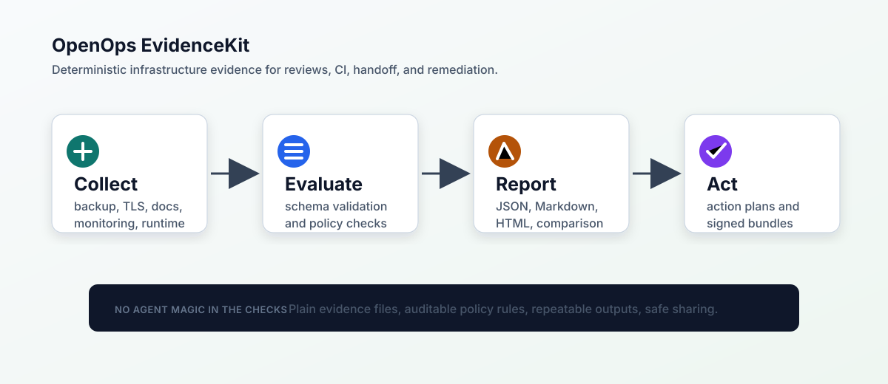

# Architecture

OpenOps EvidenceKit has four layers:

1. Collectors produce evidence JSON.
2. Policies define readiness checks in TOML.
3. The policy engine evaluates evidence without external services.
4. Reporters render JSON, Markdown, or HTML for review and documentation.

The core project avoids mandatory network calls and avoids mandatory third-party
dependencies. Integrations should be optional and should degrade cleanly.

## Trust Boundaries

Raw evidence can contain sensitive infrastructure data. EvidenceKit treats
collection, redaction, and reporting as separate steps so teams can decide what
is safe to share.

## Design Goals

- Deterministic check results.
- Human-readable remediation.
- Small, reviewable evidence files.
- Useful defaults with room for local policy.
- No secrets in fixtures or generated examples.

## Non-Goals

- Replacing monitoring systems.
- Replacing backup software.
- Providing legal or compliance certification.
- Automatically changing production infrastructure.
